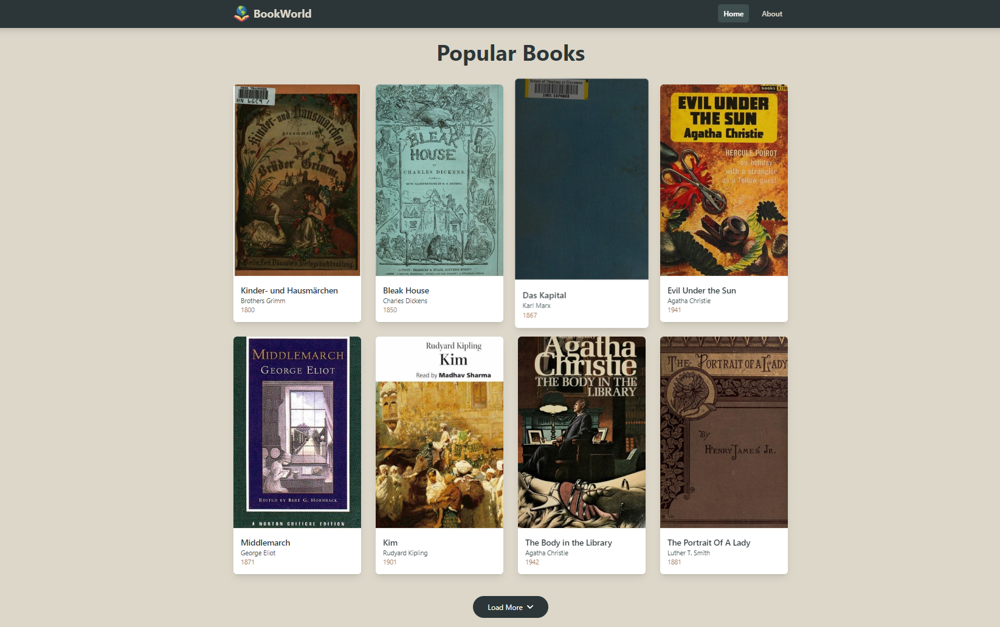
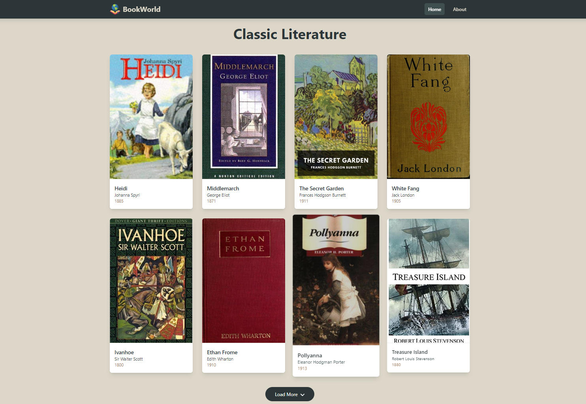

# BookWorld

BookWorld is a web app that allows users to discover, search, and explore books from a wide variety of genres. Whether you're looking for the latest bestsellers, timeless classics, or books in your favorite category, BookWorld connects readers with their next great read.

## Features

- **Extensive Library**: Access millions of books from various genres and authors worldwide.
- **Smart Search**: Find your next read using a powerful search..
- **Personalized Experience**: Discover books tailored to your interests and reading preferences.
- **Category Browsing**: Explore books in different categories such as popular books, recent releases, and classic literature.
- **Book Details**: View detailed information about each book including author, publication date, and more.
- **Responsive Design**: Optimized for both desktop and mobile devices.

## Installation

### Prerequisites

Make sure you have the following installed:

- [Node.js](https://nodejs.org/en/) (v14 or higher)
- [npm](https://www.npmjs.com/) (v6 or higher)

### Clone the repository

```bash
git clone https://github.com/Imtiyaz0312/BookWorld-bookFinder-Reactapp.git
cd bookworld
```
### Install dependencies
```bash
>> npm install
>> npm run dev
```
## Website Snippets

Welcome to my project! Here's an overview:

## Header


## Category-1



## Category-2



## About Page


